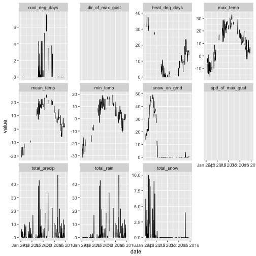
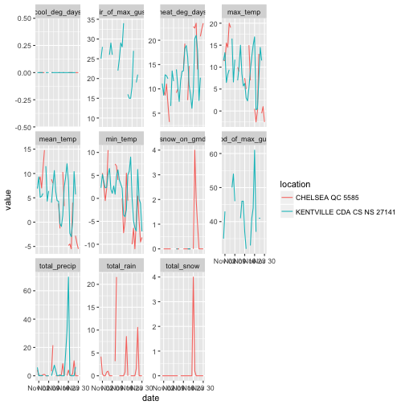

<!-- README.md is generated from README.Rmd. Please edit that file -->

<!-- rmarkdown v1 -->


# rclimateca

[](https://cran.r-project.org/package=rclimateca) [](https://travis-ci.org/paleolimbot/rclimateca) [](https://codecov.io/github/paleolimbot/rclimateca?branch=master)

Fetching data from Environment Canada's archive has always been a bit of a chore. In the old days, it was necessary to download data one click at a time from the [organization's search page](http://climate.weather.gc.ca/historical_data/search_historic_data_e.html). To bulk download hourly data would require a lot of clicks and a good chance of making a mistake and having to start all over again. There are several R solutions online (posted by [Headwater Analytics](http://www.headwateranalytics.com/blog/web-scraping-environment-canada-weather-data) and [From the Bottom of the Heap](http://www.fromthebottomoftheheap.net/2015/01/14/harvesting-canadian-climate-data/) ), but both solutions are mostly single-purpose, and don't solve the additional problem of trying to find climate locations near you. In the [rclimateca package](https://cran.r-project.org/package=rclimateca), I attempt to solve both of these problems to produce filtered, plot-ready data from a single command.

## Installation

You can install rclimateca from CRAN with:


```r
install.packages("rclimateca")
```

Or the development version from github with:


```r
# install.packages("devtools")
devtools::install_github("paleolimbot/rclimateca")
```

If you can load the package, everything worked!


```r
library(rclimateca)
```

## Finding climate stations

We will start with finding sites near where you're interested in. Sometimes you will have a latitude and longitude, but most times you will have a town or address. Using the [prettymapr](https://cran.r-project.org/package=prettymapr) package's 'geocode' function, the `ec_climate_geosearch_locations()` function looks up locations near you.


```r
ec_climate_geosearch_locations("gatineau QC")
#> Search results for ec_climate_geosearch_locations(
#>   query = "gatineau QC"
#> ) 
#>  [1] OTTAWA CITY HALL ON 4334 / 3.5 km     
#>  [2] OTTAWA LA SALLE ACAD ON 4339 / 3.5 km 
#>  [3] OTTAWA LEMIEUX ISLAND ON 4340 / 4.2 km
#>  [4] OTTAWA U OF O ON 4346 / 5.3 km        
#>  [5] OTTAWA STOLPORT A ON 7684 / 5.9 km    
#>  [6] GATINEAU QC 5590 / 6.3 km             
#>  [7] OTTAWA ON 4327 / 6.4 km               
#>  [8] OTTAWA ROCKCLIFFE A ON 4344 / 7.3 km  
#>  [9] OTTAWA BECKWITH RD ON 4330 / 7.6 km   
#> [10] OTTAWA NRC ON 4342 / 8.1 km           
#> [11] CHELSEA QC 5585 / 8.3 km              
#> [12] OTTAWA CDA ON 4333 / 8.6 km           
#> [13] OTTAWA CDA RCS ON 30578 / 8.6 km      
#> [14] OTTAWA ALTA VISTA ON 4329 / 8.8 km    
#> [15] OTTAWA NEPEAN ON 4341 / 8.8 km        
#> [16] OTTAWA RIDEAU WARD ON 4343 / 9.7 km   
#> [17] OTTAWA HOGS BACK ON 4336 / 10.3 km    
#> [18] OTTAWA BRITANNIA ON 4332 / 11.4 km    
#> [19] CITY VIEW ON 4248 / 11.9 km           
#> [20] ORLEANS VEH PRVG GND ON 4326 / 12.0 km
#> ...plus 8723 more
```

To search using the location identifier, use `ec_climate_search_locations()`:


```r
ec_climate_search_locations("gatineau")
#> Search results for ec_climate_search_locations(
#>   query = "gatineau"
#> ) 
#> [1] GATINEAU QC 5590           GATINEAU A QC 8375        
#> [3] OTTAWA GATINEAU A QC 50719 OTTAWA GATINEAU A QC 53001
```

If you also need data for a set of years, you can also pass a vector of years and a timeframe to further refine your data.


```r
ec_climate_geosearch_locations(
  "gatineau QC",
  year = 2014:2016,
  timeframe = "daily"
)
#> Search results for ec_climate_geosearch_locations(
#>   query = "gatineau QC"
#>   timeframe = "daily"
#>   year = 2014:2016
#> ) 
#>  [1] CHELSEA QC 5585 / 8.3 km (daily 1927-2017)               
#>  [2] OTTAWA CDA ON 4333 / 8.6 km (daily 1889-2017)            
#>  [3] OTTAWA CDA RCS ON 30578 / 8.6 km (daily 2000-2018)       
#>  [4] OTTAWA INTL A ON 49568 / 15.8 km (daily 2011-2018)       
#>  [5] ANGERS QC 5574 / 17.0 km (daily 1962-2017)               
#>  [6] LUSKVILLE QC 5604 / 26.8 km (daily 1980-2017)            
#>  [7] APPLETON ON 6901 / 42.4 km (daily 1992-2017)             
#>  [8] HIGH FALLS QC 27717 / 43.0 km (daily 1999-2018)          
#>  [9] KEMPTVILLE CS ON 27534 / 51.4 km (daily 1997-2018)       
#> [10] ST. ALBERT ON 4377 / 55.1 km (daily 1986-2017)           
#> [11] CHARTERIS QC 5584 / 60.4 km (daily 1980-2017)            
#> [12] DRUMMOND CENTRE ON 4268 / 63.0 km (daily 1984-2018)      
#> [13] MOOSE CREEK WELLS ON 41738 / 64.0 km (daily 2003-2018)   
#> [14] NOTRE DAME DE LA PAIX QC 5619 / 69.3 km (daily 1979-2017)
#> [15] CHENEVILLE QC 5586 / 70.2 km (daily 1964-2017)           
#> [16] WRIGHT QC 5642 / 72.8 km (daily 1967-2017)               
#> [17] CORNWALL ON 4255 / 90.5 km (daily 1950-2018)             
#> [18] BROCKVILLE CLIMATE ON 47567 / 91.0 km (daily 2008-2018)  
#> [19] MANIWAKI AIRPORT QC 5606 / 92.8 km (daily 1993-2018)     
#> [20] OMPAH-SEITZ ON 26773 / 94.4 km (daily 1994-2018)         
#> ...plus 1300 more
```

If you would like results as a data frame, you can use `as.data.frame()` or `tibble::as_tibble()` to transform the results.


```r
ec_climate_geosearch_locations(
  "gatineau QC",
  year = 2014:2016,
  timeframe = "daily"
) %>%
  as_tibble()
#> # A tibble: 1,320 x 20
#>                   location longitude latitude     timezone_id
#>                      <chr>     <dbl>    <dbl>           <chr>
#>  1         CHELSEA QC 5585    -75.78    45.52 America/Toronto
#>  2      OTTAWA CDA ON 4333    -75.72    45.38 America/Toronto
#>  3 OTTAWA CDA RCS ON 30578    -75.72    45.38 America/Toronto
#>  4  OTTAWA INTL A ON 49568    -75.67    45.32 America/Toronto
#>  5          ANGERS QC 5574    -75.55    45.55 America/Toronto
#>  6       LUSKVILLE QC 5604    -76.05    45.53 America/Toronto
#>  7        APPLETON ON 6901    -76.11    45.19 America/Toronto
#>  8     HIGH FALLS QC 27717    -75.65    45.84 America/Toronto
#>  9  KEMPTVILLE CS ON 27534    -75.63    45.00 America/Toronto
#> 10      ST. ALBERT ON 4377    -75.06    45.29 America/Toronto
#> # ... with 1,310 more rows, and 16 more variables: lst_utc_offset <dbl>,
#> #   station_id <int>, name <chr>, province <chr>, climate_id <chr>,
#> #   wmo_id <int>, tc_id <chr>, elevation_m <dbl>, first_year <int>,
#> #   last_year <int>, hly_first_year <int>, hly_last_year <int>,
#> #   dly_first_year <int>, dly_last_year <int>, mly_first_year <int>,
#> #   mly_last_year <int>
```

If you'd like to apply your own subsetting operation, the entire locations table is also available through this package.


```r
data("ec_climate_locations_all")
ec_climate_locations_all
#> # A tibble: 8,743 x 20
#>                          location longitude latitude       timezone_id
#>                             <chr>     <dbl>    <dbl>             <chr>
#>  1              ACTIVE PASS BC 14   -123.28    48.87 America/Vancouver
#>  2              ALBERT HEAD BC 15   -123.48    48.40 America/Vancouver
#>  3   BAMBERTON OCEAN CEMENT BC 16   -123.52    48.58 America/Vancouver
#>  4               BEAR CREEK BC 17   -124.00    48.50 America/Vancouver
#>  5              BEAVER LAKE BC 18   -123.35    48.50 America/Vancouver
#>  6               BECHER BAY BC 19   -123.63    48.33 America/Vancouver
#>  7          BRENTWOOD BAY 2 BC 20   -123.47    48.60 America/Vancouver
#>  8    BRENTWOOD CLARKE ROAD BC 21   -123.45    48.57 America/Vancouver
#>  9   BRENTWOOD W SAANICH RD BC 22   -123.43    48.57 America/Vancouver
#> 10 CENTRAL SAANICH VEYANESS BC 25   -123.42    48.58 America/Vancouver
#> # ... with 8,733 more rows, and 16 more variables: lst_utc_offset <dbl>,
#> #   station_id <int>, name <chr>, province <chr>, climate_id <chr>,
#> #   wmo_id <int>, tc_id <chr>, elevation_m <dbl>, first_year <int>,
#> #   last_year <int>, hly_first_year <int>, hly_last_year <int>,
#> #   dly_first_year <int>, dly_last_year <int>, mly_first_year <int>,
#> #   mly_last_year <int>
```

## Downloading data

Downloading data is accomplished using the `ec_climate_data()` function. This function takes some liberties with the original data and makes some assumptions about what is useful output (for a more "raw" output, see `ec_climate_data_base()`). As an example, I'll use the station for Chelsea, QC, because I like [the ice cream there](http://www.lacigaleicecream.ca/). The `ec_climate_data()` function can accept location identifiers in a few ways: the integer station ID, or (an unambiguous abbreviation of) the location identifier. I suggest using the full name of the location to avoid typing the wrong station ID by accident.


```r
# find the station ID (CHELSEA QC 5585)
ec_climate_search_locations("chelsea", timeframe = "daily", year = 2015)
#> Search results for ec_climate_search_locations(
#>   query = "chelsea"
#>   timeframe = "daily"
#>   year = 2015
#> ) 
#> [1] CHELSEA QC 5585 (daily 1927-2017)

# the same as:
# ec_climate_data(5585, ...)
ec_climate_data("CHELSEA QC 5585", timeframe="daily", 
                start = "2015-01-01", end = "2015-12-31")
#> # A tibble: 365 x 29
#>             dataset        location  year month   day       date
#>               <chr>           <chr> <int> <int> <int>     <date>
#>  1 ec_climate_daily CHELSEA QC 5585  2015     1     1 2015-01-01
#>  2 ec_climate_daily CHELSEA QC 5585  2015     1     2 2015-01-02
#>  3 ec_climate_daily CHELSEA QC 5585  2015     1     3 2015-01-03
#>  4 ec_climate_daily CHELSEA QC 5585  2015     1     4 2015-01-04
#>  5 ec_climate_daily CHELSEA QC 5585  2015     1     5 2015-01-05
#>  6 ec_climate_daily CHELSEA QC 5585  2015     1     6 2015-01-06
#>  7 ec_climate_daily CHELSEA QC 5585  2015     1     7 2015-01-07
#>  8 ec_climate_daily CHELSEA QC 5585  2015     1     8 2015-01-08
#>  9 ec_climate_daily CHELSEA QC 5585  2015     1     9 2015-01-09
#> 10 ec_climate_daily CHELSEA QC 5585  2015     1    10 2015-01-10
#> # ... with 355 more rows, and 23 more variables: data_quality <chr>,
#> #   max_temp_c <dbl>, max_temp_flag <chr>, min_temp_c <dbl>,
#> #   min_temp_flag <chr>, mean_temp_c <dbl>, mean_temp_flag <chr>,
#> #   heat_deg_days_c <dbl>, heat_deg_days_flag <chr>,
#> #   cool_deg_days_c <dbl>, cool_deg_days_flag <chr>, total_rain_mm <dbl>,
#> #   total_rain_flag <chr>, total_snow_cm <dbl>, total_snow_flag <chr>,
#> #   total_precip_mm <dbl>, total_precip_flag <chr>, snow_on_grnd_cm <dbl>,
#> #   snow_on_grnd_flag <chr>, dir_of_max_gust_10s_deg <dbl>,
#> #   dir_of_max_gust_flag <chr>, spd_of_max_gust_km_h <dbl>,
#> #   spd_of_max_gust_flag <chr>
```

The package can also produce the data in parameter-long form so that you can easily use [ggplot](https://cran.r-project.org/package=ggplot2) to visualize.


```r
df <- ec_climate_data("CHELSEA QC 5585", timeframe="daily", 
                start = "2015-01-01", end = "2015-12-31") %>%
  ec_climate_long()
  
ggplot(df, aes(date, value)) + 
  geom_line() + 
  facet_wrap(~param, scales="free_y")
```



The function can accept a vector for most of the parameters, which it uses to either download multiple files or to trim the output, depending on the parameter. How to Chelsea, QC and Kentville, NS stack up during the month of November (Pretty similar, as it turns out...)?


```r
df <- ec_climate_data(
  c("CHELSEA QC 5585", "KENTVILLE CDA CS NS 27141"), 
  timeframe = "daily", start = "2015-11-01", "2015-11-30"
) %>%
  ec_climate_long()
#> Downloading 2 files (use quiet = FALSE for details)

ggplot(df, aes(date, value, col = location)) + 
  geom_line() + 
  facet_wrap(~param, scales="free_y")
```



You will also notice that a little folder called `ec.cache` has popped up in your working directory, which contains the cached files that were downloaded from the Environment Canada site. You can disable this by passing `cache = NULL`, but I don't suggest it, since the cache will speed up running the code again (not to mention saving Environment Canada's servers) should you make a mistake the first time.

This function can download a whole lot of data, so it's worth doing a little math for yourself before you overwhelm your computer with data that it can't all load into memory. As an example, I tested this function by downloading daily data for every station in Nova Scotia between 1900 and 2016, which took 2 hours, nearly crashed my computer, and resulted in a 1.3 gigabyte data frame. If you're trying to do something at this scale, have a look at `ec_climate_data_base()` to and extract data from each file without loading the whole thing into memory.

## Using with mudata2

The rclimateca package can also output data in [mudata format](http://github.com/paleolimbot/mudata), which includes both location data and climate data in an easily plottable object.


```r
library(mudata2)
md <- ec_climate_mudata("CHELSEA QC 5585", timeframe = "daily", 
                        start = "2015-01-01", end = "2015-12-31")
autoplot(md)
#> Using x = "date", y = "value"
```


## Dates and times

The worst thing about historical climate data from Environment Canada is that the dates and times of hourly data are reported in [local standard time](http://climate.weather.gc.ca/glossary_e.html#l). This makes it dubious to compare hourly data from one location to another. Because of this, the hourly output from Environment Canada is confusing (in my opinion), and so the output from `ec_climate_data()` includes both the UTC time and the local time (in addition to the EC "local standard time"). These two times will disagree during daylight savings time, but the moment in time represented by both `date_time_*` columns is correct. To see these times in another timezone, use `lubridate::with_tz()` to change the `tzone` attribute. If you must insist on using "local standard time", you can use a version of `date + time_lst`, but you may have to pretend that LST is UTC (I haven't found an easy way to use a UTC offset as a timezone in R).


```r
ec_climate_data(
  "KENTVILLE CDA CS NS 27141", timeframe = "hourly", 
  start = "1999-07-01", end = "1999-07-31"
) %>%
  select(date, time_lst, date_time_utc, date_time_local)
#> # A tibble: 744 x 4
#>          date time_lst       date_time_utc     date_time_local
#>        <date>   <time>              <dttm>              <dttm>
#>  1 1999-07-01 00:00:00 1999-07-01 04:00:00 1999-07-01 01:00:00
#>  2 1999-07-01 01:00:00 1999-07-01 05:00:00 1999-07-01 02:00:00
#>  3 1999-07-01 02:00:00 1999-07-01 06:00:00 1999-07-01 03:00:00
#>  4 1999-07-01 03:00:00 1999-07-01 07:00:00 1999-07-01 04:00:00
#>  5 1999-07-01 04:00:00 1999-07-01 08:00:00 1999-07-01 05:00:00
#>  6 1999-07-01 05:00:00 1999-07-01 09:00:00 1999-07-01 06:00:00
#>  7 1999-07-01 06:00:00 1999-07-01 10:00:00 1999-07-01 07:00:00
#>  8 1999-07-01 07:00:00 1999-07-01 11:00:00 1999-07-01 08:00:00
#>  9 1999-07-01 08:00:00 1999-07-01 12:00:00 1999-07-01 09:00:00
#> 10 1999-07-01 09:00:00 1999-07-01 13:00:00 1999-07-01 10:00:00
#> # ... with 734 more rows
```
